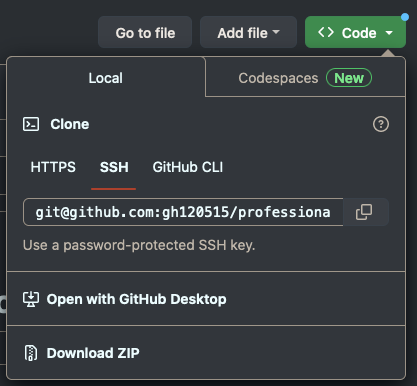
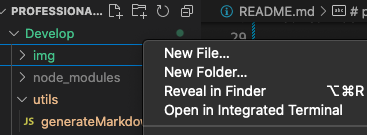
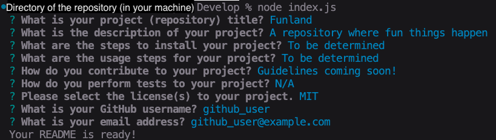
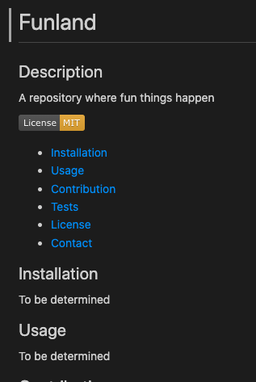

# professional-README-generator

## Description

This app will allow you to generate a simple, professional README file through a series of prompts.

The app was built to practice the builder's knowledge and skills in developing basic backend apps, using node.js and using packages such as inquirer (collect information) and fs (read/write data).

## Installation

It is assumed that the user of this app has some basic knowledge in code editing (the app itself can be used through the below steps).

The following are required to use this app:

1. Download the repository 

You can do this through the 'Code' button above this README; for example, you can clone the repository to your local machine.

2. Node.js

You can skip this step if you already have Node.js in your local machine - you can check your current version in your terminal through the below command:

    node -v

Otherwise, [this link](https://nodejs.dev/en/learn/how-to-install-nodejs/) will highlight some common options to install Node.js - do note that the process may vary between MacOS, Windows and Linux.

Functionality has been confirmed on Node.js version 16.20.0. Note that other versions may not function as intended.

## Usage

After performing the basic setup, open the repository that you downloaded / cloned - you can do this in multiple ways, such as through the terminal.

The most convinient method is through VS Code (source-code editor program), which has a function where you can directly open the terminal in the directory (right-click on the 'Develop' folder, then select 'Open in Integrated Terminal').

After opening the repository directory (in the 'Develop' folder) in the terminal, enter the following to run the app:

    node index.js

Follow the prompts (example below) then your README will be generated.

Below is a snippet of the README generated using the above responses. Edit the resulting README (the file & file name) to suit your needs.

## Credits

README template based on the [Professional README Guide](https://coding-boot-camp.github.io/full-stack/github/professional-readme-guide).

It is highly recommended to refer to this guide when editing your README.

### Tutorials:
[Javascript Promises vs Async Await EXPLAINED (in 5 minutes)](https://www.youtube.com/watch?v%3Dli7FzDHYZpc) by Roberts Dev Talk

[Node.js util.promisify() Method](https://www.geeksforgeeks.org/node-js-util-promisify-method/) by hunter__js

## License

MIT Licensed